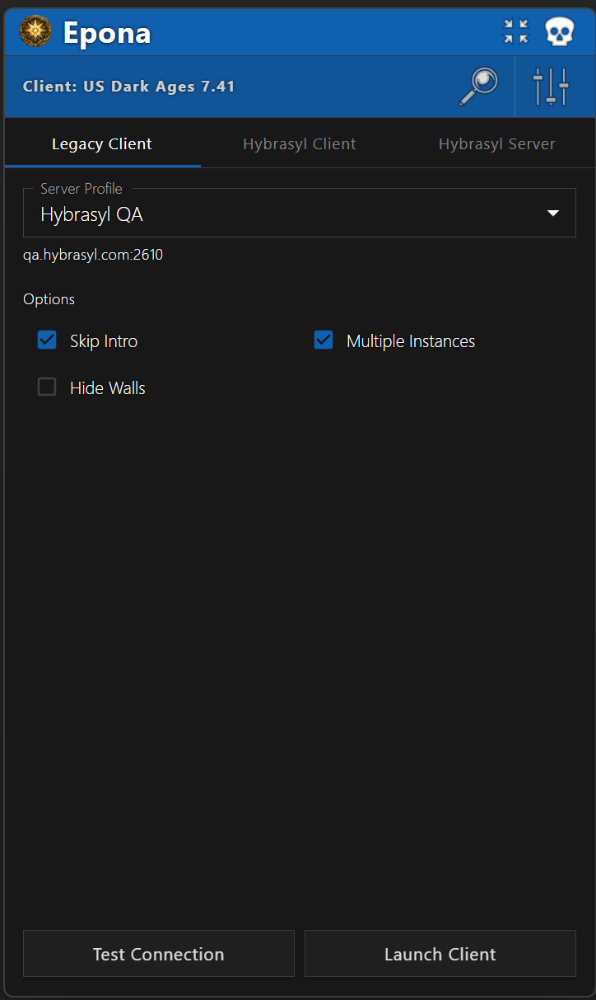
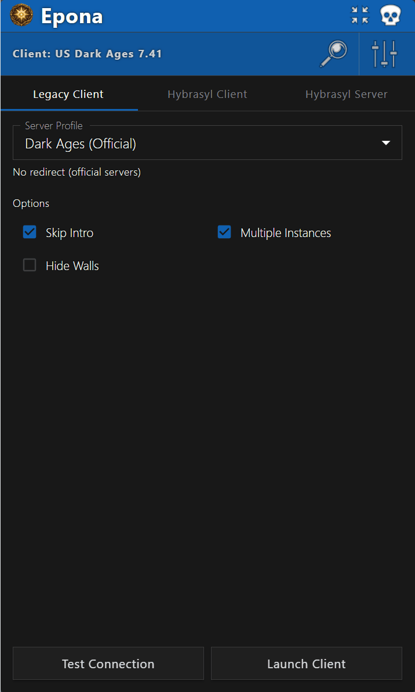
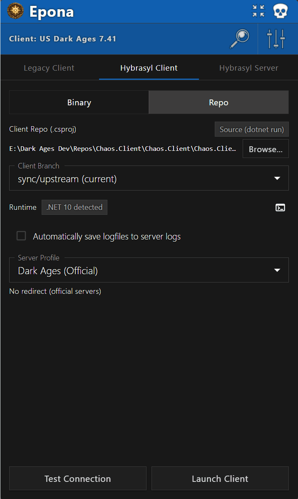
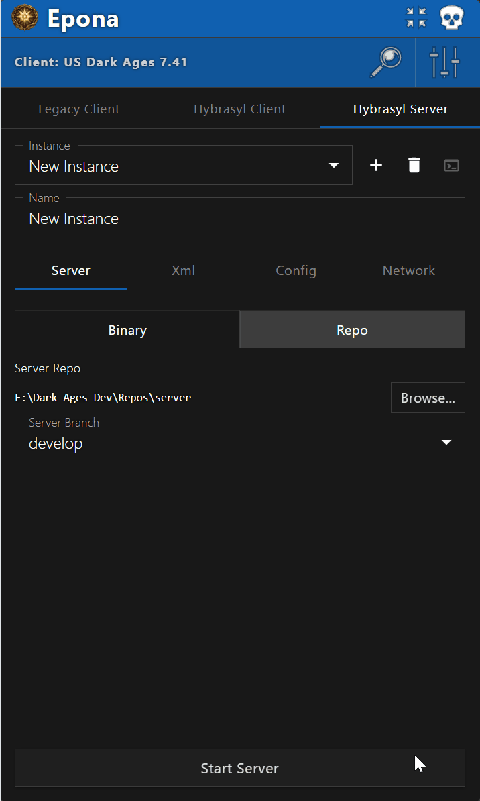
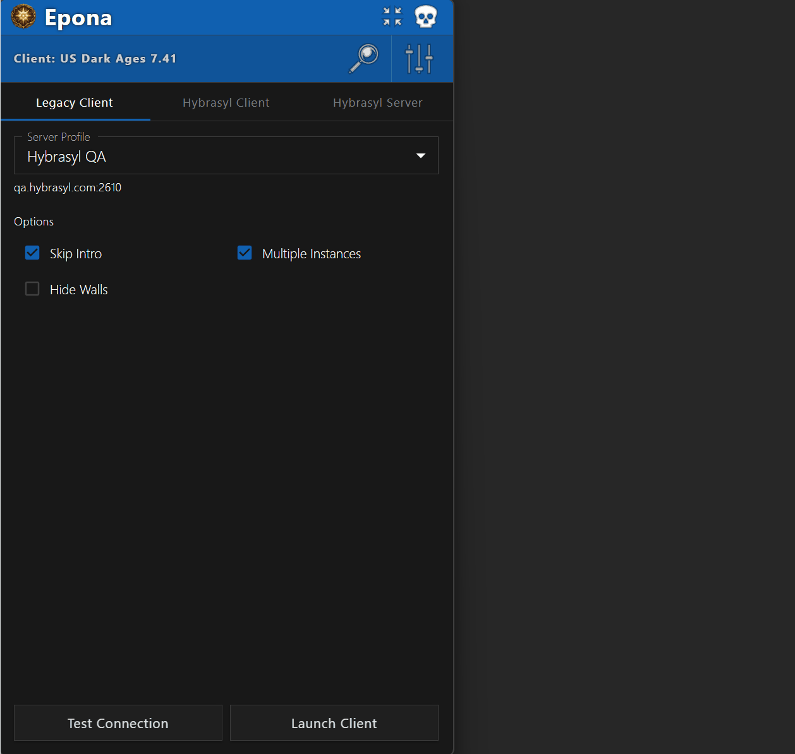

# Epona



Dark Ages launcher + Hybrasyl server orchestrator. Single tool for
launching legacy DA clients, launching modern Hybrasyl clients, and
managing local Hybrasyl server instances — built on Electron + React +
MUI, sharing a stack with [Creidhne](https://github.com/hybrasyl/creidhne)
and [Taliesin](https://github.com/hybrasyl/taliesin).

The window has three tabs, each driving a different launch target.

<br clear="all" />

---

## Legacy Client tab



In-memory patching of an unmodified DA client at launch. No files on
disk are modified — every patch is written to the running process's
memory via Win32 kernel32 APIs.

- **Server profiles** — define and switch between named server
  configurations (official, localhost, custom redirect targets); each
  profile carries hostname, port, and a redirect toggle.
- **Skip intro** — bypass the intro video sequence.
- **Multiple instances** — allow more than one client to run
  simultaneously.
- **Hide walls** — toggle wall visibility.
- **Auto-detect client version** — MD5 hash detection of the picked
  `Darkages.exe`.
- **Server connection tester** — validates server reachability using
  the DA wire-protocol handshake (welcome → version → status).

**Windows only.** The Win32 process patches don't have a portable
equivalent. Running on macOS or Linux requires a compatibility layer
(Wine, CrossOver) and your mileage may vary; the tab shows an inline
warning when launched on a non-`win32` platform.

### Supported client versions

| Version | MD5 hash |
| --- | --- |
| US Dark Ages 7.37 | `36f4689b09a4a91c74555b3c3603b196` |
| US Dark Ages 7.39 | `ca31b8165ea7409d285d81616d8ca4f2` |
| US Dark Ages 7.40 | `9dc6fb13d0470331bf5ba230343fce42` |
| US Dark Ages 7.41 | `3244dc0e68cd26f4fb1626da3673fda8` |

### Known caveat: use `127.0.0.1` instead of `localhost`

The Legacy redirect path resolves your profile's hostname via
`dns.lookup` and writes the resulting IP into the DA client's memory
as four raw bytes. On systems where `localhost` resolves to `::1`
first (IPv6 — modern Windows often prefers it), the IPv4 byte-split
produces `NaN` and the patch writes garbage; the client then can't
connect.

**Workaround**: set `127.0.0.1` directly in the profile's hostname
field for local-server redirects. DNS resolution of a literal IPv4
is a no-op, so this side-steps the IPv6 pickup.

This only affects the Legacy target — Hybrasyl Client uses env-var
redirection (`DA_HOST`) which goes through the .NET socket layer
that handles hostnames natively. Tracked in `legacyTarget.js:39`;
the fix is `lookup(profile.hostname, { family: 4 })` to force IPv4.

---

## Hybrasyl Client tab



Launches the modern open-source Hybrasyl client — either a prebuilt
`.exe` or a `.csproj` source checkout via `dotnet run`.

- **Path resolution** — pick a `.exe` (fire-and-forget, multi-instance
  allowed) or a `.csproj` (singleton, source-launched, stdio piped to
  the LogPane). The header chip shows which mode resolved.
- **`Darkages.cfg` templating** — the active server profile's hostname
  and port are merged into `Darkages.cfg` before spawn, preserving
  every other line in the file. Same parser semantics as the sibling
  client repo's `DarkagesCfg`.
- **.NET 10 runtime detection** — chip warns when the runtime is
  missing or only an older version is installed (source launches need
  `Microsoft.NETCore.App 10.x`).
- **Side LogPane** — for source launches, stdout/stderr stream into a
  resizable side pane with auto-scroll, clear, save-to-file, and
  jump-to-latest controls. Disabled with a tooltip for `.exe` mode (no
  piped stdio).
- **Auto-save logs** — opt-in checkbox dumps the captured stdout/stderr
  of each repo-mode launch to the active server instance's `logDir` on
  client exit (`hybrasyl-client-<timestamp>-pid<n>.log`). Disabled when
  no active server instance has a log directory set.

Cross-platform in principle, since `dotnet run` works wherever .NET is
installed. Windows is the primary tested target.

---

## Hybrasyl Server tab



Multi-instance management for local Hybrasyl server processes. The
star feature of 2.0.

- **Multi-instance CRUD** — add / select / delete / reset / launch
  named server instances; each carries its own ports, Redis overrides,
  data directory, server config XML, and launch mode.
- **Binary mode** — point at a prebuilt server `.dll` (wrapped in
  `dotnet <dll>`) or self-contained `.exe`.
- **Repo mode** — point at a server git checkout; launches via
  `dotnet run --project hybrasyl/Hybrasyl.csproj`. Branch-aware: pick
  any branch and Epona materializes a git worktree at
  `.worktrees/<branch>/`, refcounted across instances and reaped on
  Epona quit.
- **Local Hybrasyl.Xml** — repo mode can also override the XML library
  with a local checkout's `Hybrasyl.Xml.csproj` via a generated
  `Directory.Build.props` (requires the `UseLocalXml` conditional on
  the server csproj — server commit `11bc748` or later).
- **World directories registry** — see below; per-instance picker is a
  dropdown over the registered entries, not a path picker.
- **Server config XML auto-detection** — scans
  `<worldDataDir>/xml/serverconfigs/` for files whose second line
  begins with `<ServerConfig` and offers them as a dropdown. The
  selected config's `<DataStore>` block is parsed for the Redis
  endpoint Epona probes pre-launch.
- **Per-instance Redis overrides** — leave host blank to read the
  endpoint from the config XML (the usual case); set host/port/db/
  password to emit `HYB_REDIS_*` env vars instead. Memurai install
  hint shown next to the Redis caption when the probe fails on a
  loopback target.
- **Pre-flight checks** — Redis reachability via real RESP `PING`
  round-trip (catches WSL2 localhost-forwarding false positives that
  would otherwise stall `StackExchange.Redis` mid-handshake), and
  pure-TCP port-in-use probe on the lobby port.
- **Reset button** — kill + relaunch in one IPC round-trip; useful
  when iterating on scripts or XML without doing a full Stop → Start.
- **Log folder quick-open** — the FolderOpen icon next to the Log Dir
  field opens the folder in Explorer; works while the instance is
  running so you can tail logs live.
- **PowerShell wrapper console** — Windows launches go through a
  `Start-Process` shim that wraps the server in a base64-encoded
  PowerShell script and blocks on `Read-Host` after exit. Crash
  output stays readable; the wrapper PID is captured so Stop can
  `taskkill /F /T` the entire process tree.

### World directories registry

Pick a Hybrasyl world data dir (the inner repo containing
`xml/serverconfigs/`, `mapfiles/`, `scripts/`, etc — typically a
clone of [Ceridwen](https://github.com/hybrasyl/ceridwen) or a
private equivalent) once, and reference it by ID across multiple
instances.

- **Manage in the Settings pane** — add, edit, delete entries. Star
  icon toggles which entry is the default for new instances. Delete
  is disabled when an entry is in use; the tooltip shows the count.
- **At-pick validation** — picking the wrong folder (e.g. the
  Hybrasyl-org parent instead of the world repo itself) is rejected
  with a snackbar pointing at `xml/serverconfigs/` as the canonical
  shape marker.
- **Editing a path propagates** — change a registry entry's path and
  every instance pointing at it picks up the new path on next launch.
  Deduped at migration time so multiple legacy `dataDir` values that
  pointed at the same folder collapse into one entry.

See [`docs/server-launch-resolution.md`](docs/server-launch-resolution.md)
for how the server resolves `--worldDataDir` / `--dataDir` / `--logDir`
/ `--config` (CLI flag → `HYB_*` env → built-in default) and why
Epona always passes both `--dataDir` and `--worldDataDir` explicitly.

---

## Settings & data



Settings persist to `%APPDATA%\Erisco\Epona\settings.json` (roaming).
Chromium's cache and other Electron transients live separately under
`%LOCALAPPDATA%\Erisco\Epona\`.

- **Atomic writes** — every save writes `settings.tmp.json` and
  renames over `settings.json` so a crash mid-save can't leave the
  file half-written. The previous primary is copied to
  `settings.bak.json` before rename, so corrupt settings can be
  recovered on next load.
- **Schema migrations on load** — settings written by older Epona
  versions are migrated forward in-memory; the migrated shape is
  persisted on the next save. No-op once already migrated.
- **Themes** — five themes: Hybrasyl, Chadul, Danaan, Grinneal
  (shared with Creidhne and Taliesin) and Spark (a faithful port of
  the original WPF launcher's dark theme).

---

## da-win32

Reusable N-API C++ addon wrapping the kernel32 functions Epona's
Legacy target needs. Lives in [`packages/da-win32/`](packages/da-win32/)
and is designed to be extracted to its own published package when
sibling tools (e.g. Taliesin asset injection) need the same calls.

| JS function | kernel32 call |
| --- | --- |
| `createSuspendedProcess(path)` | `CreateProcessA` |
| `openProcess(pid, access)` | `OpenProcess` |
| `writeProcessMemory(handle, addr, buf)` | `WriteProcessMemory` |
| `readProcessMemory(handle, addr, size)` | `ReadProcessMemory` |
| `resumeThread(handle)` | `ResumeThread` |
| `suspendThread(handle)` | `SuspendThread` |
| `closeHandle(handle)` | `CloseHandle` |

All Win32 handles are exposed as JS `BigInt` — never coerced to
`Number`.

---

## Installation

Pre-built portable releases for Windows are on the
[releases page](../../releases). Download `Epona-x.y.z-portable.exe`
and run it directly — no installer, no admin rights required.

## Building from source

Requires Visual Studio Build Tools with the C++ workload (the native
addon is C++ + node-gyp). Node.js 18+; CI uses Node 24.

```bash
npm install
npm run rebuild         # rebuild da-win32 against Electron's ABI
npm run dev             # development (renderer hot-reload)
npm run build:portable  # Windows portable .exe (output in dist/)
npm run build:mac       # macOS dmg + zip (must run on macOS, unsigned)
npm run build:linux     # Linux AppImage (must run from WSL2 or a Linux host)
npm test                # vitest suite
npm run lint            # eslint + prettier
```

CI auto-publishes the Windows portable on tag push; macOS and Linux
artifacts are produced locally by maintainers and attached to the
release page when available.

Releases are produced via GitHub Actions on `v*` tag push — see
[`docs/release-process.md`](docs/release-process.md) for the full
flow and [`.github/workflows/release.yml`](.github/workflows/release.yml)
for the workflow definition.

## Project structure

| Path | Purpose |
| --- | --- |
| `packages/da-win32/` | Reusable N-API native addon for Win32 process interop |
| `src/main/` | Electron main process — IPC handlers, settings manager, line buffer, runtime detection, server tester, port probe |
| `src/main/targets/` | Per-target launchers — `legacyTarget.js` (Win32 patches), `hybrasylTarget.js` (client exe / dotnet run), `serverTarget.js` (binary / repo with worktrees) |
| `src/main/gitOps.js`, `worktreeManager.js`, `buildProps.js` | Git plumbing for repo-mode launches |
| `src/preload/` | Context bridge exposing `sparkAPI` to the renderer |
| `src/renderer/src/components/` | UI components — title bar, nav toolbar, profile selector, options, action buttons, settings pane, log pane, server instance panel, hybrasyl client panel |
| `src/renderer/src/themes/` | MUI themes (Hybrasyl, Chadul, Danaan, Grinneal, Spark) |
| `docs/` | Active design docs (`server-launch-resolution.md`, `release-process.md`); `docs/completed/` archives shipped plan docs |

## Contributing

Issues and pull requests welcome. Please open an issue before starting
significant work.

## Author

[Caeldeth](https://github.com/Caeldeth)

## License

See [LICENSE](LICENSE) for details.

---

*Epona is the spiritual successor to [Spark](https://github.com/hybrasyl/spark)
(C#/WPF), rewritten on the Electron stack and substantially expanded
to cover Hybrasyl client launches and server orchestration in addition
to the original DA-launcher remit.*
